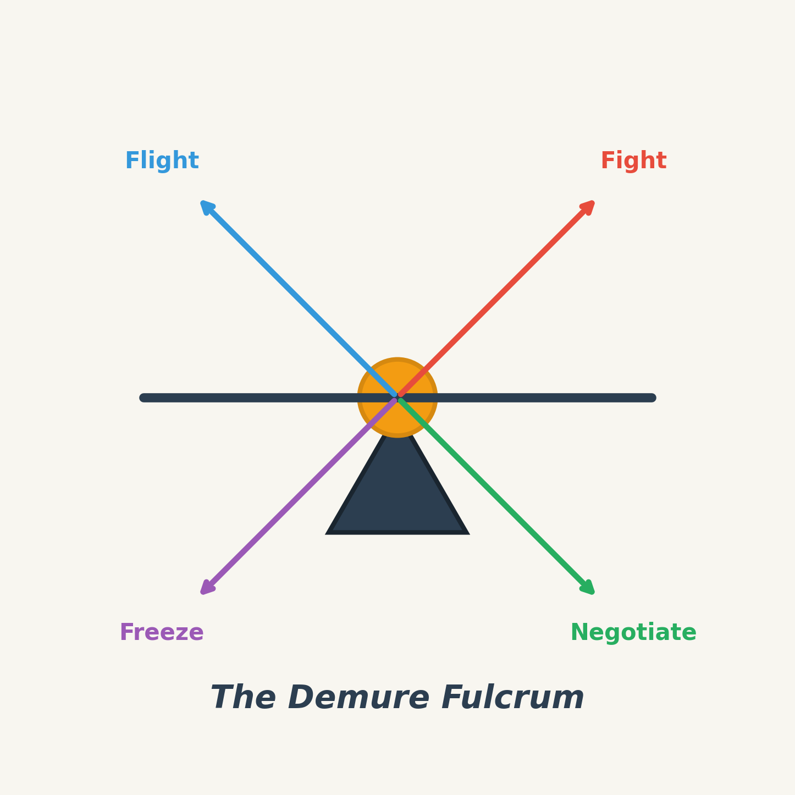

# The Demure Fulcrum



## Abstract

**The Demure Fulcrum** proposes negotiation as a fourth meta-option in the stress response paradigm, expanding beyond the classical fight-flight-freeze triad. This theoretical framework posits that self-aware beings possess a unique capacity for deliberate, strategic engagement with threats and challenges—a balanced pivot point (the "fulcrum") from which conscious agents can choose to negotiate outcomes rather than defaulting to instinctual responses. The theory integrates perspectives from evolutionary psychology, philosophy of mind, and cross-cultural behavioral studies to establish negotiation not merely as a learned skill, but as a fundamental adaptive capacity emergent in beings capable of metacognition and theory of mind.

## Table of Contents

### Academic Paper
- [The Demure Fulcrum: Full Academic Paper](paper/The_Demure_Fulcrum_Academic_Paper.md) ([PDF](paper/The_Demure_Fulcrum_Academic_Paper.pdf))

### Research Components
- [Psychological Foundations](research/01_psychological_foundations.md)
- [Philosophical & Evolutionary Perspectives](research/02_philosophical_evolutionary.md)
- [Cultural Manifestations](research/03_cultural_manifestations.md)

## Citation

If you use or reference this work, please cite as:

```
Demure, D. (2026). The Demure Fulcrum: Negotiation as a Fourth Meta-Option 
in the Stress Response Paradigm. GitHub Repository. 
https://github.com/DanielDemure/The-Demure-Fulcrum
```

## License

This work is licensed under the MIT License. See [LICENSE](LICENSE) for details.

---

*"Between stimulus and response there is a space. In that space is our power to choose our response."* — Viktor E. Frankl
